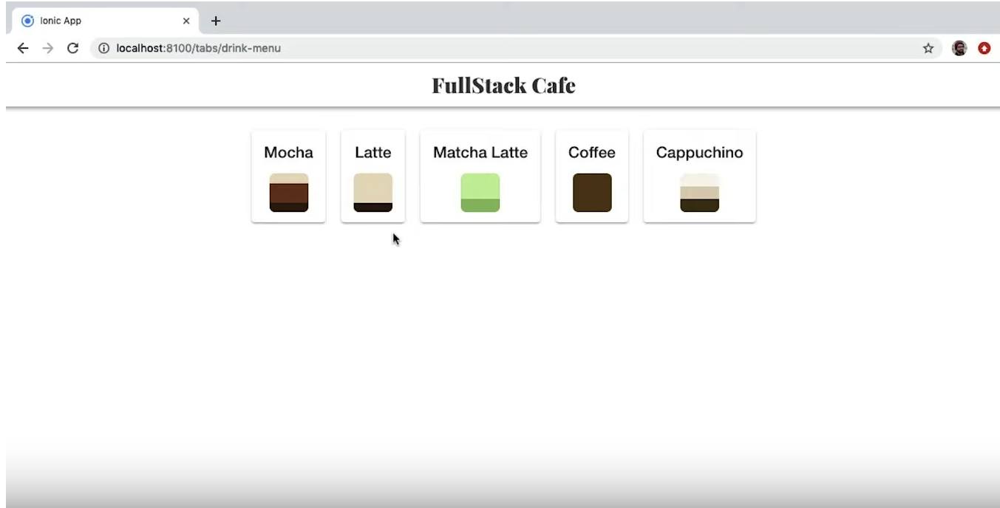
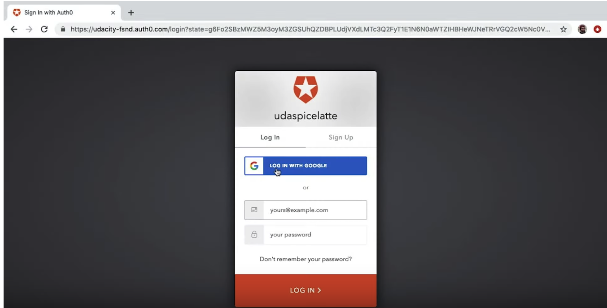
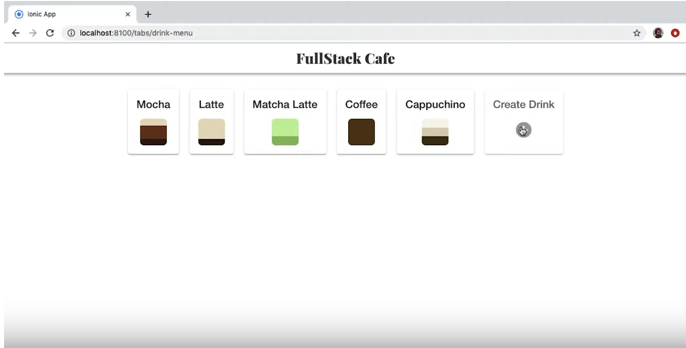

Techno Barista
-----
Techno Barista is a new digitally enabled cafe for people to order drinks, socialize, and study hard. 
Permission Based Acess Control or [PBAC] archticeture is used to provide additional functionalities to the users.
There are 3 roles pre-defined of Manager ,Barista and customer.

### Tech Stack
* **Python3** and **Flask** 
* **SQLAlchemy ORM** 
* **PostgreSQL** 
* **Flask-Migrate** 
* **HTML**, **CSS**, and **Javascript** with [Bootstrap 3]
* **Auth0** 

### Authorization
For authorization I have used Auth0.
The application follows Role-based-permission-Control or [RBAC] architecture.






### Development Setup

To start and run the local development server,

1. Initialize and activate a virtualenv:
  ```
  $ cd YOUR_PROJECT_DIRECTORY_PATH/
  $ virtualenv --no-site-packages env
  $ source env/bin/activate
  ```

2. Install the dependencies:
  ```
  $ pip install -r requirements.txt
  ```

3. Run the development server:
  ```
  $ export FLASK_APP=myapp
  $ export FLASK_ENV=development # enables debug mode
  $ python3 app.py
  ```

4. Navigate to Home page [http://localhost:5000](http://localhost:5000):
